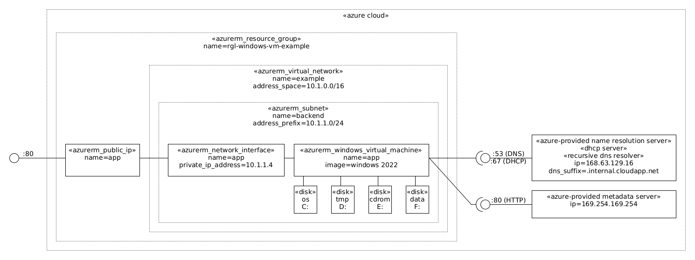

an example azure ubuntu virtual machine



# Usage (on a Ubuntu Desktop)

Install the tools:

```bash
./provision-tools.sh
```

Login into azure-cli:

```bash
az login
```

List the subscriptions and select the current one if the default is not OK:

```bash
az account list
az account set --subscription=<id>
```

Review `main.tf` and maybe change the `location` variable.

Initialize terraform:

```bash
make terraform-init
```

Launch the example:

```bash
make terraform-apply
```

At VM initialization time a Custom Script Extension will run the `provision.ps1` script to customize the VM and launch the example web application.

After VM initialization is done (the log is stored at `c:\AzureData\provision-log.txt`), test the `app` endpoint:

```bash
wget -qO- "http://$(terraform output app_ip_address)/test"
```

You can also list all resources:

```bash
az resource list --resource-group rgl-windows-vm-example --output table
```

# Reference

* [Azure virtual machine extensions and features](https://docs.microsoft.com/en-us/azure/virtual-machines/extensions/overview)
* [Azure Virtual Machine Agent overview](https://docs.microsoft.com/en-us/azure/virtual-machines/extensions/agent-windows)
* [Custom Script Extension for Windows](https://docs.microsoft.com/en-us/azure/virtual-machines/extensions/custom-script-windows)
