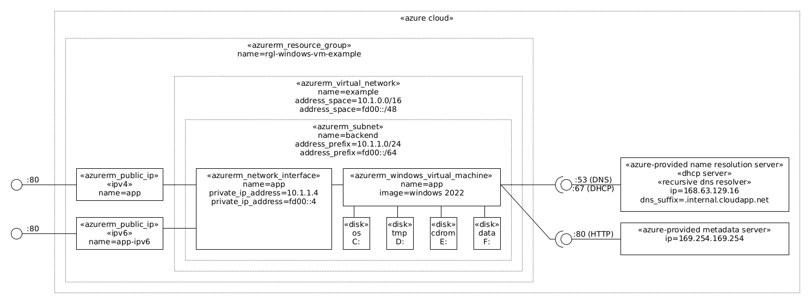

an example azure ubuntu virtual machine



# Usage (on a Ubuntu Desktop)

Install the tools:

```bash
./provision-tools.sh
```

Login into azure:

```bash
az login
```

List the subscriptions:

```bash
az account list --all
az account show
```

Set the subscription:

```bash
export ARM_SUBSCRIPTION_ID="<YOUR-SUBSCRIPTION-ID>"
az account set --subscription "$ARM_SUBSCRIPTION_ID"
```

Review `main.tf` and maybe change the `location` variable.

Initialize terraform:

```bash
make terraform-init
```

Launch the example:

```bash
make terraform-apply
```

At VM initialization time a Custom Script Extension will run the `provision.ps1` script to customize the VM and launch the example web application.

Get the initialization script status:

```bash
az vm get-instance-view \
    --resource-group rgl-windows-vm-example \
    --name app \
    --query instanceView.extensions
```

After VM initialization is done (the log is stored at `c:\AzureData\provision-log.txt`), test the `app` endpoint:

```bash
while ! wget -qO- "http://$(terraform output --raw app_ip_address)/test"; do sleep 3; done
while ! wget -qO- "http://[$(terraform output --raw app_ipv6_ip_address)]/test"; do sleep 3; done
```

You can also list all resources:

```bash
az resource list \
    --resource-group rgl-windows-vm-example \
    --output table
```

You can execute commands:

```bash
# NB unfortunately, run-command is somewhat limited. for example, it only
#    outputs last 4k of the command output.
#    see https://learn.microsoft.com/en-us/azure/virtual-machines/windows/run-command#restrictions
az vm run-command invoke \
    --resource-group rgl-windows-vm-example \
    --name app \
    --command-id RunPowerShellScript \
    --scripts 'whoami /all' \
    > output.json \
    && jq -r '.value[].message' output.json \
    && rm output.json
az vm run-command invoke \
    --resource-group rgl-windows-vm-example \
    --name app \
    --command-id RunPowerShellScript \
    --scripts 'param([string]$name)' 'Write-Host "Hello $name!"' \
    --parameters 'name=Rui' \
    > output.json \
    && jq -r '.value[].message' output.json \
    && rm output.json
```

Access using RDP, either using Remmina or FreeRDP:

```bash
remmina --connect "rdp://rgl@$(terraform output --raw app_ip_address)"
xfreerdp "/v:$(terraform output --raw app_ip_address)" /u:rgl /size:1440x900 +clipboard
```

Inside the RDP session, open a PowerShell session, and poke around:

```powershell
ipconfig /all
route print
ping -6 -n 3 2606:4700:4700::1111    # cloudflare dns.
ping -6 -n 3 2606:4700:4700::1001    # cloudflare dns.
ping -6 -n 3 ff02::1                 # all nodes.   # NB does not work in azure.
ping -6 -n 3 ff02::2                 # all routers. # NB does not work in azure.
ping -4 -n 3 ip6.me
ping -6 -n 3 ip6.me
Resolve-DnsName ip6.me
Resolve-DnsName ip6.me -Server 2606:4700:4700::1111
curl.exe -4 https://ip6.me/api/ # get the vm public ipv4 address.
curl.exe -6 https://ip6.me/api/ # get the vm public ipv6 address.
curl.exe http://ip6only.me/api/ # get the vm public ipv6 address.
curl.exe http://10.1.1.4/test   # try the app private ipv4 endpoint.
curl.exe http://[fd00::4]/test  # try the app private ipv6 endpoint.
$ipv6_public_test_url="http://[$(((curl.exe -6 -s https://ip6.me/api/) -split ',')[1])]/test"
curl.exe "$ipv6_public_test_url" # try the app public ipv6 endpoint.
echo @"
go to https://dnschecker.org/server-headers-check.php and test the app ipv6 url:
$ipv6_public_test_url
"@
exit
```

Destroy the example:

```bash
make terraform-destroy
```

# Reference

* [Azure virtual machine extensions and features](https://learn.microsoft.com/en-us/azure/virtual-machines/extensions/overview)
* [Azure Virtual Machine Agent overview](https://learn.microsoft.com/en-us/azure/virtual-machines/extensions/agent-windows)
* [Custom Script Extension for Windows](https://learn.microsoft.com/en-us/azure/virtual-machines/extensions/custom-script-windows)
